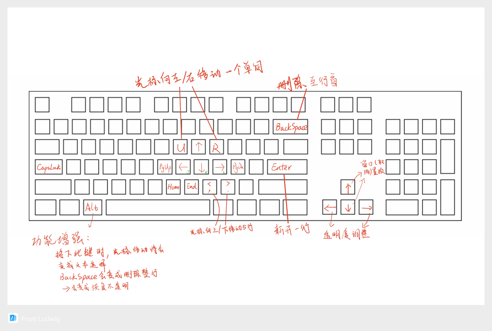
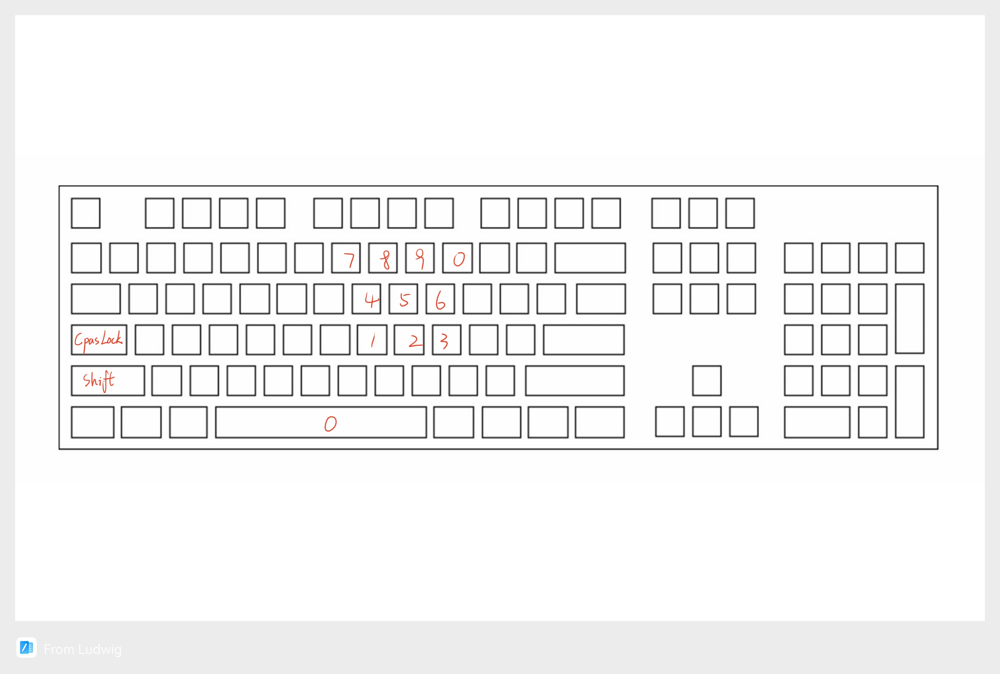

# Capslock-(CapsLock Minus)

## 概述

### 简介

Capslock-是一个加强一点Capslock键的功能，但不多，以提高效率的工具。

该工具创作思路来源于另一款功能完备的工具名为Capslock+，我本人也长时间使用该工具，深感好用。

但在长时间的使用过程中，我也发现有些不太适合我的点（只是不太适合我，并不是缺点）：

1. 作为一款增强工具，它实在是太强了，强到了增添了许多我其实根本用不上的工具。像是TabScript，WinBind，QBar，翻译等等。这些功能也许对某些人很实用，但对于我这个崇尚less is more的人来说，用不上的东西我就想删掉。

2. 作为我最常用的文字编辑功能，其默认采用的vim风格键位我并不喜欢。但是得益于Capslock+本身提供了自定义键位的功能，所以我也一直靠着自己编写自定义配置用过来了。

因此，我重新基于AHK2开发了一款精简版的Capslock+，名为Capslock-（也许可以读作Capslock Minus）。

它仅仅支持以下功能：

1. 文本编辑增强（也是最主要的，我用得最多的功能）；
2. 应用窗口控制功能（摸鱼神器）；

### 声明

没有任何措施来强制收费，因为 Capslock- 是免费的。但是如果你执意要打钱给我的话请狠狠联系我。

## 使用方法

推荐方法：
安装AHK2，然后下载该仓库。双击SmartBoard.ahk执行即可。
如遇开机启动，可将SmartBoard.ahk文件创建快捷方式放入StartUp文件夹。
好处是：
1. 兼容性好，编译exe文件我只有一台电脑，没有经过充分测试。
2. 软件更新时只需git pull即可。（不使用git的小伙伴可重新下载仓库后覆盖即可）

如果您执意使用exe，请[在此](./SmartBoard.exe)右键另存为，即可下载软件。但不保证可靠性。

您也可以自行编译，入口文件为SmartBoard.ahk，使用AHK2开发。

## 功能介绍

* CapsLock

按住大写键，可以将[IJKL]映射为↑←↓→，[UO]为前/后一个单词，[NM]为Home/End，[,.]为上/下5行，[H;]为PageUp/PageDown

按住大写键，同时按住Alt键，配合上述移动光标功能，即可在移动光标同时选中文本。

* 热键设计原则

1. 热键应该使用方便。

所谓使用方便，就是双手自然控制，无需过多挪动双手，无需做出别扭的动作。本软件尽可能将热键设计为左手按住功能键进行修饰，右手实现功能。

举个例子，当左手修饰两个键时，常为CapsLock+Alt，而不会是CapsLock+Ctrl，因为前者可以由尾指和拇指自然按住，左手无需过多移动，后者按住则较为别扭，特别是当需要长时间按住时手指容易疲劳。而在左手按住修饰键时，功能区只在右手可轻松触及的地方，而不会出现CapsLock+Alt+R这样别扭的热键。

2. 热键不能破坏原有的任何热键，只做加法。

## TO DO

* [ ]开发帮助功能
* [ ]开发触摸板手势功能
* [ ]可以增加一些常用软件功能的支持，比如微信、钉钉，浏览器等
* [ ]鼠标微调功能，用于弥补触摸板不能微调的缺陷
* [ ]多媒体控制功能，控制音量，播放暂停，上一首下一首等
* [ ]亮度调节功能
* [ ]可视化编辑配置
